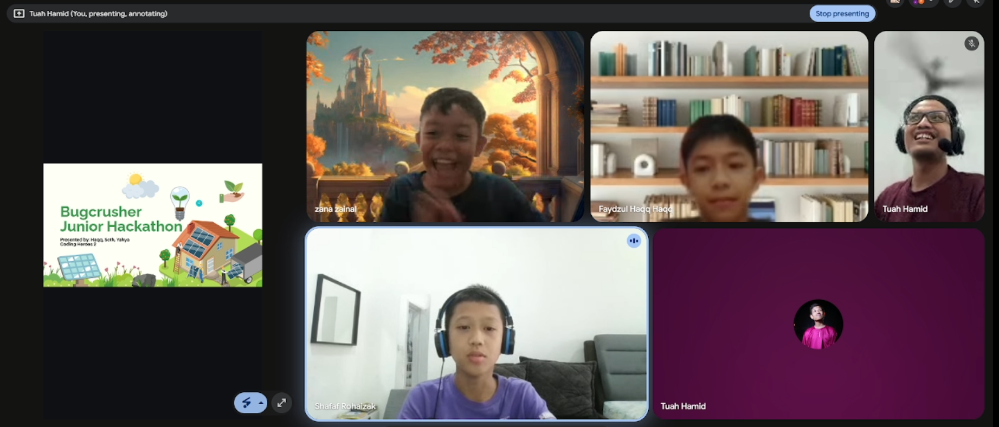

+++
date = '2026-09-28T09:00:00+08:00'
draft = false
title = 'When a student goes quiet, whose fault is it?'
+++

In April 2026, I led four kids, all 12 to 13 years old, into the [Bugcrusher](https://bugcrusher.net/) Jr Hackathon. We spent the weeks before practising on bugged [Scratch](https://scratch.mit.edu/) files and learning to document our work in Canva: a kanban board, issues sorted into important and not important, easy wins, who fixes what. I was a little impressed that they were doing the same triage I do at my 9-5.

On the day, we met at 8:30 to settle in and preload our pages and templates. At 9:00 we opened the first bug and gave ourselves ten minutes. It took forty-five. By the time we cracked it, two of the kids sounded defeated, because they knew the plan had already slipped. We recovered enough to submit on time, but our documentation was thinner than we'd hoped, and we didn't qualify for the next round.

What I remember most isn't the result. It's one of the four, a former Scratch student of mine whom I used to label, privately, as the quiet one. In the concluding video he was on camera, mic on, trading banter (including the occasional 67) with the other three. I had never once seen that in a one-on-one session with him.

## How I got here

Nine months earlier, I took the coding instructor job for a simple reason: I wanted a part-time gig I could do from my home office. I almost didn't apply. The ad asked for a "programmer," and my corporate title isn't that. I assumed a data scientist at a bank or a software engineer at a semiconductor giant would look better on paper. I got the interview anyway, argued my case with the d-wall solver I built for an underground station design, and got the job.

## The mistake

A year in, after dozens of students, this is the mistake I'm surest about. When a student didn't respond the way I expected, I blamed my delivery. 
> The problem, I now think, was how I was counting responses. 
I counted the webcam and the microphone, and sometimes chat. I assumed every student arrived knowing how to operate a computer and a browser.

The quiet student showed me this most clearly. In one-on-one sessions, when I asked whether he understood, he would answer "I don't understand" in Scratch notes, not out loud. I saw the notes as a channel, but I didn't count them as a real response, and that was one of my early mistakes. Then, among three peers, he was a different kid. I don't know why he was quiet with me and loud with them. Maybe it was being with equals instead of an adult. What I do know is that he had been answering me all along.

## Not every silence is a choice

Another student, whom I've taught from Scratch through to [micro:bit](https://makecode.microbit.org/), arrived not knowing how to use Meet. He struggled with screen share, couldn't find the chat, and couldn't keep his mic working consistently. When he went quiet, I marked the session as a bad one. He got comfortable with the platform over time, and later placed first in our midterm Kahoot quiz. The sessions I'd filed as bad were telling me about Meet, not about him as a developing student.

Too much response has its own problem. One student has no trouble following my screen or speaking up, but she often speaks over me mid-sentence and breaks the train of thought for the whole class. My fix is "let me finish first, and I'll come back to you." That's also a response format that needs agreeing on.

## When it really was my delivery

Blaming my delivery isn't always wrong. There was one student I couldn't reach with my usual format: slides of concepts first, then mini exercises, then a game. That's the format I've sat through since college and in my 9-5, so it was my default. He drifted from the screen. I flipped the order, showing a finished game first and then building it together, even if he didn't yet understand what a [Broadcast](https://en.scratch-wiki.info/wiki/broadcast) was. It helped him follow along, but he mostly coded when I coded, so I wouldn't call it solved. The channels weren't the problem there. The format was.

## What I'd do differently

In my case, fault placement followed how narrowly I defined a good response. Next term, Lesson 1 will start with how we respond to each other, before any Scratch. We'll agree on formats: mic, chat, emoji reactions (a thumbs-up counts), screen-share practice, and taking turns. I can offer channels, but how a kid uses them, especially in front of peers versus alone with me, is theirs. I'll learn that by watching.
