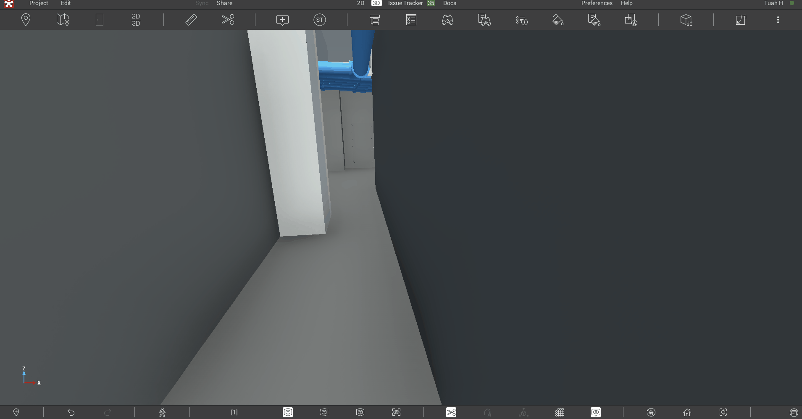
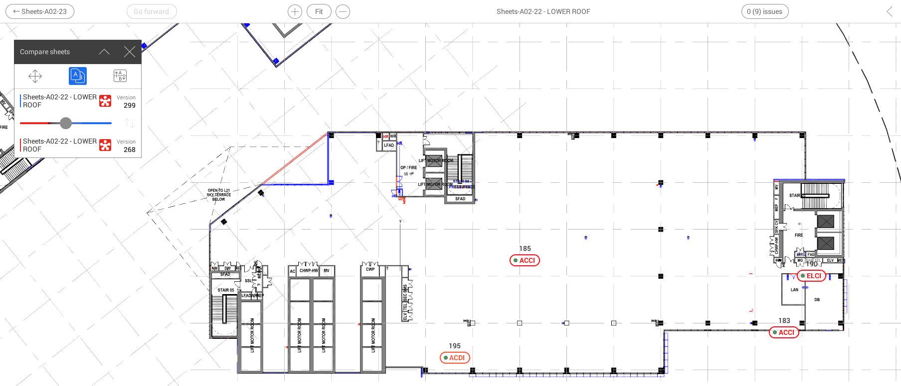
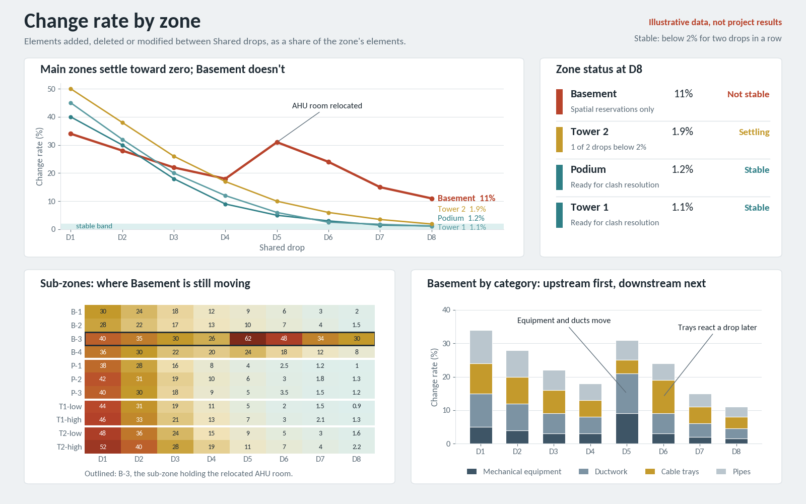

+++
date = '2026-09-30T09:00:00+08:00'
draft = true
title = "Coordinating on ground that wouldn't hold still"
+++

Our overseas team proposed moving an AHU room in the Basement. It sat too close to the risers, and the big ducts coming out of the risers would have competed for space with the big ducts coming out of the AHU. Moving it made sense. Architecture and HVAC knew about it. Electrical didn't. They had already committed their cable containment to the old layout, and they were sprinting on the next deliverable on a different floor. Before each weekly BIM meeting, my job was to review the model that had been published. That week the AHU room had moved, and electrical heard about it in the meeting. For them it came as a surprise, and I suspect it was a morale killer too.

That wasn't the only time. By the end of tender, much of the coordination I had run felt like it had produced value that expired almost as fast as we delivered it.

## How I got here

I was a BIM coordinator on an overseas hospital project, from schematic design to tender. Our office in Malaysia modeled the MEP services. Our overseas team handled the client and the consultants.

There were six MEP services, each split into four zone models: Basement, Podium, Tower 1 and Tower 2. We federated them for coordination and ran clash reviews across the zones.

## Where the effort went

> In my case, the coordination work was reasonable. The problem was that we coordinated at full depth on zones that were not stable yet.

Under deadline pressure before tender, every trade worked on a different floor with a different deliverable. The way I understand it, coordination runs in an order: equipment and ducts set the space, then trays and pipes fit around them. So when an upstream trade changed a zone, it could quietly break work a downstream trade had already called finished.

Design change is normal on any project. Part of my job was to carry information across teams, but sometimes things moved too fast, and it didn't occur to the trade making the change to give the others a heads-up. The design also kept changing after the tender deadline. By late September there were five corrigenda.

## What held up

Revizto held up well as a tool, and two features in particular earned their place.

The laser ranger, under 3D and then Dimension, let me quickly estimate or check whether a corridor was wide enough for access, or for a new wide service run to cross it.

<!-- TODO: add compressed revizto-laser-ranger.gif to this folder (currently 14.5MB, needs compression) -->
<!--  -->

Compare Sheets let us study the layout changes architecture and structure had committed. In one review, we saw our water tank at roof level hanging over the roof boundary. We knew the previous boundary had been sufficient and the tank had been placed properly. Comparing the two versions of the sheet, with the geometry differences highlighted in blue and red, let us trace the change back to the commit that caused it.

## What I still don't know

My role ended at tender, so I had been demobilized before most of the corrigenda came through. I knew they had been issued, but I didn't see what was in them. I don't know how much they changed the MEP design itself, and how much they only changed scope and contract terms. So I can't say how much of the rework each corrigendum caused.

## It felt like our fault

For most of the project, rework felt like our own inefficiency. We modeled it, coordinated it, then did it again.

Looking back, I think most of it came from upstream. The ground was still moving under the zones we were detailing. I can't prove that, because nothing we tracked would show it. That is the gap I want to close.

## Measuring change rate

The idea is to measure how much each zone changes between one shared model drop and the next: elements added, deleted or moved. A burndown chart tracks how much work is left. This tracks whether the ground is still moving. In a zone that is settling, the number should fall toward zero.

The water tank shows the limit of what we had. Compare Sheets told us what changed, but only on a sheet we already suspected. Change rate would show where things changed in every zone, before anyone noticed a clash.

The version I'm sketching takes a snapshot of each model from Revit at every shared drop, compares the snapshots in Power BI, and charts the result by zone. It isn't built yet, and I haven't tested it on a real project.

If it works, it lets me say "this zone isn't stable yet" instead of "the design keeps changing." The first is evidence. The second is a complaint.

It has to read as design stability, not performance. A chart that says one discipline changes too much becomes a blame chart, and people stop feeding it data.

## What I'd do differently

I'll start with the cheapest version. On my next project, at every shared drop, I'll export element counts per category for each zone model from a Revit schedule. When a zone another trade has already submitted shows new or removed equipment or ducts, that becomes a task for the affected trades before the clashes show up.

Counts won't catch an element that moved, only ones added or removed. It's crude, but it will tell me whether the idea is worth building properly.

Looking back, I don't think the effort was wasted. It expired early because we spent it before the ground had settled, and that is something I can learn to see. The AHU room moved for a good reason, and rooms like it will move again on the next project. What I can change is whether electrical hears about it in a weekly meeting, or sees it coming a week earlier.
