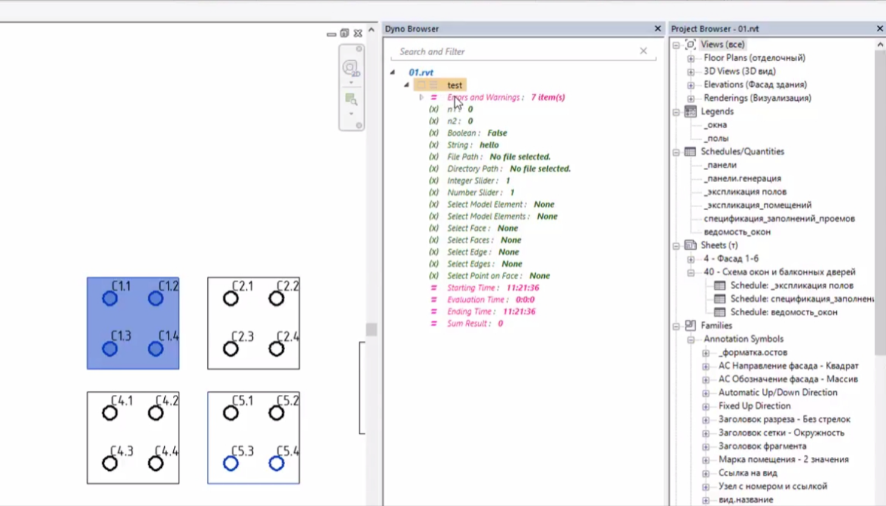
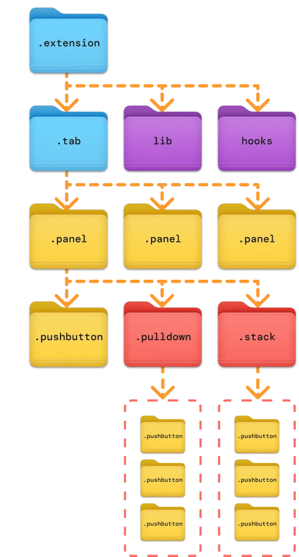
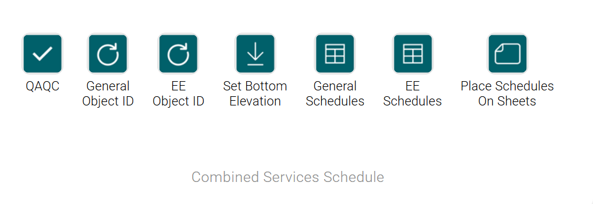
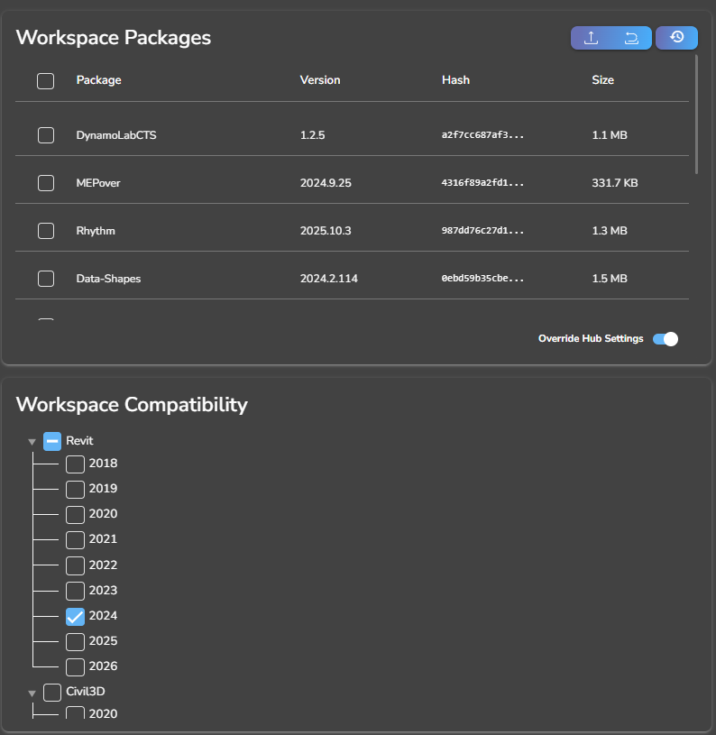
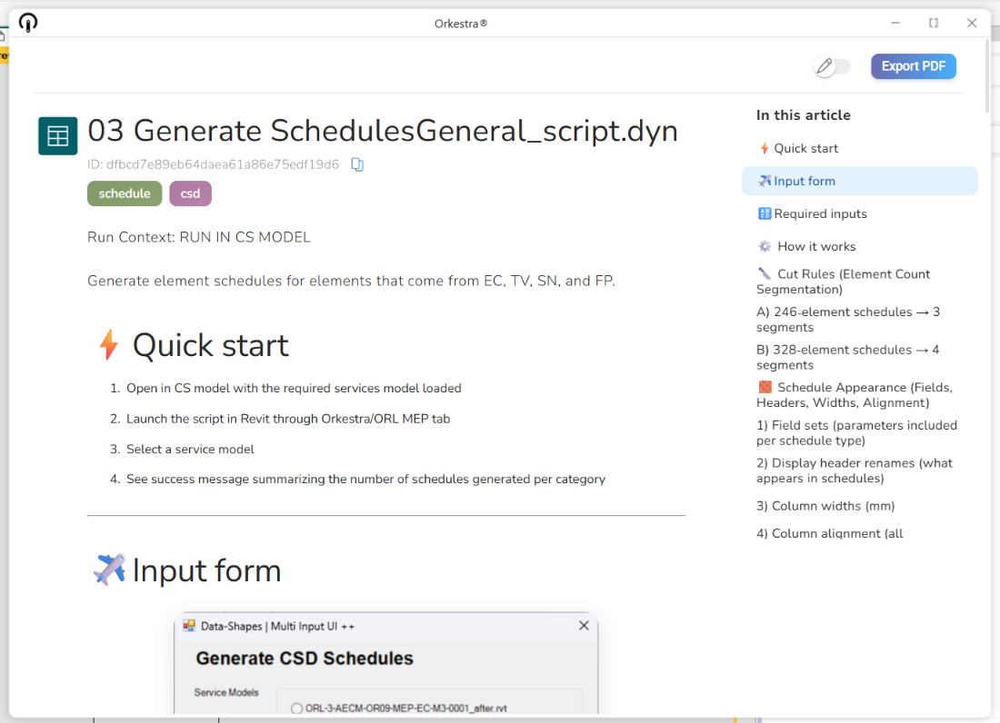
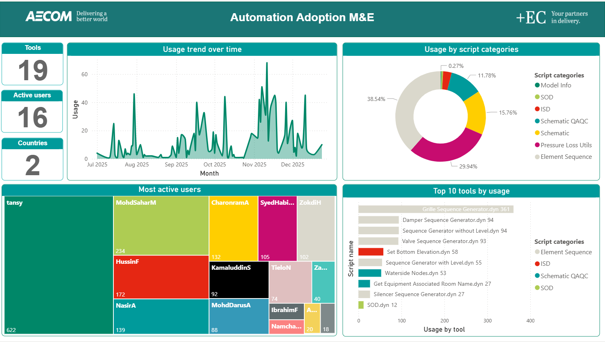

+++
date = '2026-02-02T09:00:00+08:00'
draft = true
title = 'I Tried 3 Dynamo Graph Deployment Tools So You Do Not Have To '
+++

*This file includes placeholders for GIFs, images, and external links.*

## Outside looking in 👀
Dynamo continues to grow in relevance within the Revit ecosystem, especially with its transition to the modern .NET 8 platform and CPython engine. My confidence in Dynamo also increased when [John Pierson](https://github.com/johnpierson) joined Autodesk as part of the Dynamo team. Anyone who has used Rhythm or Monocle knows how much he has shaed the experience for beginners and advance users alike. IMO, his presence signals that Dynamo is moving in a meaningful and community centered direction.

With Dynamo becoming faster and more stable, I have been spending more time thinking about something far less glamorous but absolutely essential for real practice, which is how to deploy Dynamo tools to real users. Whether I was working with a formwork manufacturer or in my current role at a design consultancy, one pattern never changed.

## Why Deployment Matters 🤝
Real users do not want to open Dynamo or manage packages. They want a simple button inside Revit that performs tasks reliably and consistently every time. That simplicity takes effor to deliver.

Deployment is the hidden layer that determines whether your automation feels like a polished feature or an experimentatl script. This article compares three deployment tools that shaped my experience across manufacturing and consulting environments.

---

## Dyno ▶️
[Dyno](https://www.bing.com/search?pglt=171&q=dyno+prorubim&cvid=f4a6a4abd378402880d45f328d50ce4e&gs_lcrp=EgRlZGdlKgkIABBFGDsY-QcyCQgAEEUYOxj5BzIGCAEQRRg5MgYIAhAAGEAyBggDEAAYQDIGCAQQLhhAMgYIBRBFGDwyBggGEEUYPDIGCAcQRRg8MgYICBBFGEEyCAgJEOkHGPxV0gEIMTUxOWowajGoAgCwAgA&FORM=ANNAB1&PC=U531) was the first tool that made Dynamo feel like it belonged to . It created a bridge between visual logic of Dynamo and the day-to-day workflow of designers who prefer clicking icons rather than moving nodes and graphs. It served the community well during the R17 to R20 period.

However, it has not kept pace with Revit development, and R20 was the last supported version. The ecosystem has moved through several architectural shifts since where it was. I still appreciate what it represented, because it set the stage for everything that came later, but it is no longer part of my workflow today.

---

## pyRevit 🐍
[pyRevit](https://docs.pyrevitlabs.io/) provides powerful control for authors who want to curate custom toolsets which can be written in Python, C#, Dynamo or even Grasshopper. It gives the author so much control , especially through its bundle structure.

### Bundle Architecture
The folder driven structure allows transparent organization. The ribbon that users see in Revit is a direct reflection of the of the bundle folder structure.

A bundle may include:
- A tool folder
- A Dynamo graph
- An icon file
- Metadata for naming and visibility

### Custom Ribbon Panels
pyRevit generates ribbon panels directly from its bundle structure. Beyond the standard panel layout, authors can customize further with stacking and drop downs to create polished and compact interface. This allows Dynao tools to sit alongside Python tools in a seamless manner.

While the ribbon panels is excellent in spreading custom Dynamo tools in Revit tab, I still need to manage custom dynamo packages manually to my users.

---

## Orkestra 💡
[Orkestra](https://orkestra.online/) presents an entirely different experience focused on governance and ease for end users. Intead of pushing responsibility onto authors or expecting users to troubleshoot package issues, Orkestra handles the operational side with much more structure. The following are my top features that Orkestra Online currently offers.

### Ribbon Builder GUI
Instead of structuring folders manually, Orkestra provides a graphical interface. I can visually manage, create, and arrange Dynamo content from existing workspace. Being able to drag and drop graphs into panels and rename tools for users makes the experience far more intuitive.

### Automatic Package Management
Orkestra ensures users receive the correct versions of packages with every tool. This eliminates mismatch issues, greatly reduces troubleshooting, and especially helpful when you have users spanning accross different countries. The stability this brings to Dynamo deployment is one of its strongest advantages, in my opinion.

### Embedded Documentation
One of my favourite capabilities. I can write documentation in Markdown, and Orkestra renders it as a clean HTML like page within the platform. This allows me to explain assumptions, outline steps, and provide visual guidance right next to the tool itself. This feature has definitely turned me into a more disciplined builder with detailed documentation in mind.

### Analytics and the Analytics API
Orkestra tracks tool usage and exposes an analytics API that lets me query raw data. This enables integration with my corporate database tables for curated reporting and lets me understand which tools are actually delivering value. Over time, this will shape how I prioritize development and support.

**

---

## Conclusion
Each tool contributed to my understanding of Dynamo deployment. Today, Orkestra stands out as my preferred solution due to its Ribbon Builder, package management, embedded documentation, and analytics capabilities.